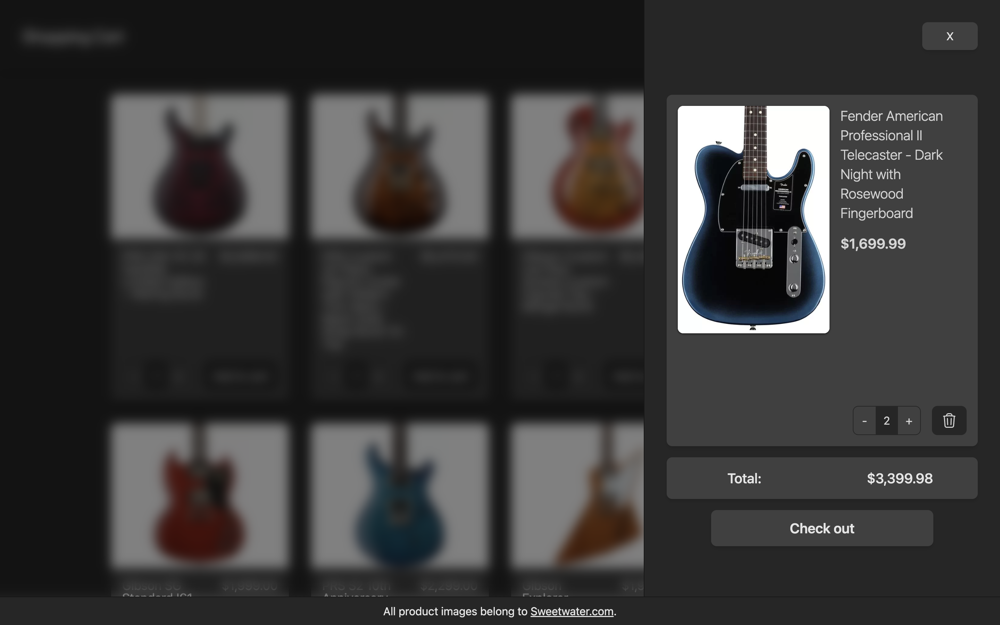
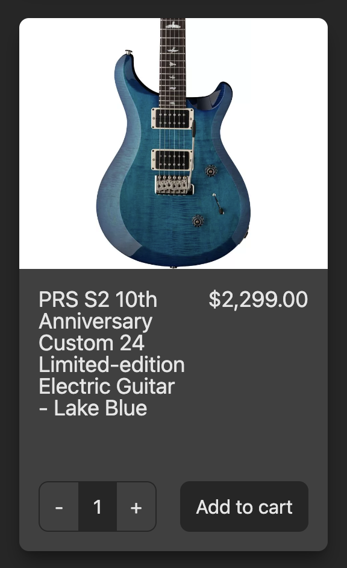
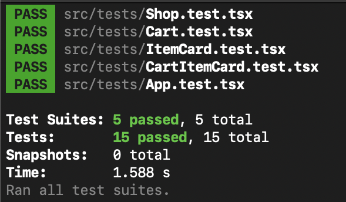

# Shopping Cart

<p align = 'center'>
  
</p>

---

## Description

A responsive front-end interface for online shopping e-commerce applications

This project is made with React, TypeScript, Tailwind CSS, React Router, and Jest.

_Other tools used in this project include the React Testing Library, ESLint, Prettier, and GitHub Pages._

---

## Table of Contents

- [Installation](#installation)
- [Usage](#usage)
- [Features](#features)
- [Tests](#tests)
- [Reflections](#reflections)

---

## Installation

There are a couple of ways to run the software:

1. The easier way is to visit the [online live preview](https://royojeda.github.io/shopping-cart/).

2. The other option is to clone the repository to your own machine by running the following commands in the command line (you must have **Git** and **Node.js** installed):

   ```bash
   git clone git@github.com:royojeda/shopping-cart.git
   ```

   and then run:

   ```bash
   cd shopping-cart
   ```

   to enter the project directory, then:

   ```bash
   npm install
   ```

   to install the dependencies, and finally:

   ```bash
   npm start
   ```

   to run the local development server.

---

## Usage

The application makes use of client-side routing using React Router. There are two pages—the landing page and the shop page.

The landing page is a simple static page with a prompt to visit the shop page.

<p align="center">
  
</p>

The shop page contains most of the complex behavior of the app. It contains a display of the shop items in the form of cards containing the item details, along with a simple form for adding items to the shopping cart with a variable quantity.

<p align="center">
  
</p>

The shopping cart can be accessed by clicking on the top-right button to bring up a sidebar that displays the cart items. Within this sidebar, items can have their quantities increased, decreased, or removed altogether. The total cost for the cart items with their respective quantities is displayed at the bottom, just above the check out button. This button does not have any functionality and may be used to redirect the user to a separate payment page.

<p align="center">
  
</p>

---

## Features

- **Single-Page Application Reactivity**. With the aid of React and React Router, this application only ever loads a single HTML document, dynamically rewriting the content in response to user events. The page never refreshes when items are added to or removed from the cart, or if the cart item quantities are changed. This gives the feeling of a native application by reducing transition times.

- **Responsive Design**. The application is made to be usable on any screen size. From narrow vertical mobile devices to ultrawide monitor displays. The design is developed mobile-first, because it's much easier to adapt a design to wider screens than the other way around.

- **Centralized Data Storage**. The details of shop items are neatly stored inside a single JSON file to simulate fetching from a back-end API. This allows easy integration with whatever back-end application, as long as it can serve JSON data in the proper format.

---

## Tests

This application contains automated tests written using Jest and the React Testing Library. Although not strictly developed test-first, these tests still allowed early identification of bugs during the development.

To run the tests, execute the following command in the terminal:

```bash
npm test
```

<p align="center">
  
</p>

---

## Reflections

The project puts knowledge with React Router and the React Testing Library into practice. Testing React interfaces feels quite different from unit-testing normal JavaScript logic, but it's convenient that Jest can be used with them all the same.

It's not quite as fun to demonstrate compared to games, but maybe these kinds of applications, which mostly deal with CRUD operations on data, more closely resemble real-world projects.
